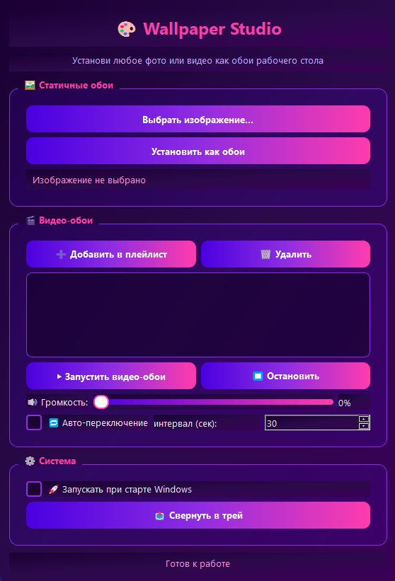

# 🎨 Wallpaper Studio

**Wallpaper Studio** — это легковесное и стильное приложение для Windows, разработанное [bear574](https://github.com/bear574). Оно позволяет устанавливать любые фотографии или видео в качестве живых обоев вашего рабочего стола. Приложение поддерживает создание плейлистов, автоматическую смену видео по таймеру и работу в фоновом режиме.

<p align="center">
  
</p>

## ✨ Возможности

- 🖼 **Статичные обои:** Быстрая установка изображений популярных форматов (PNG, JPG, BMP, WEBP).
- 🎬 **Живые видео-обои:** Воспроизведение видеофайлов прямо на рабочем столе позади системных ярлыков.
- 📋 **Плейлисты:** Возможность добавить сразу несколько видеороликов в общий список.
- ⏱ **Авто-переключение:** Циклическая смена видео из плейлиста через заданный интервал времени (в секундах).
- 🔊 **Контроль звука:** Встроенная регулировка громкости видео-обоев от 0% до 100%.
- 🚀 **Автозапуск:** Опция автоматического запуска приложения вместе со стартом Windows.
- 📥 **Работа в фоне:** Кнопка «Свернуть в трей» прячет программу в панель задач, снижая визуальную нагрузку.
- 🎨 **Современный UI:** Насыщенный интерфейс в темно-фиолетовых тонах с яркими неоновыми градиентами.

## 📋 Системные требования

- **ОС:** Windows 10 / 11 (64-bit).
- **VLC Media Player:** Для работы воспроизведения видео **обязательно** должен быть установлен плеер VLC (64-bit). Его можно скачать бесплатно на [официальном сайте VideoLAN](https://videolan.org).

## 🛠 Как пользоваться

1. **Для обычных фото:** В верхнем блоке нажмите *«Выбрать изображение...»*, укажите путь к файлу и нажмите *«Установить как обои»*.
2. **Для видео:** В блоке «Видео-обои» нажмите *«➕ Добавить в плейлист»* и выберите файлы.
3. **Управление плейлистом:** Нажмите *«▶ Запустить видео-обои»* для старта. Чтобы приостановить воспроизведение, используйте кнопку *«■ Остановить»*.
4. **Настройка слайдшоу:** Поставьте галочку на *«Авто-переключение»* и введите нужный интервал смены роликов.
5. **Фоновый режим:** Нажмите *«Свернуть в трей»*. Полное закрытие программы доступно через контекстное меню (правый клик по иконке приложения возле часов Windows) — пункт «Выход».

## 🚀 Установка и сборка

### Клонирование репозитория
```bash
git clone https://github.com
cd Wallpaper-Studio
```

### Предварительные требования
Для работы проекта из исходного кода установите зависимости:
```bash
pip install PyQt5 python-vlc pyinstaller
```

### Сборка в .exe файл
Чтобы собрать проект в один исполняемый файл с помощью PyInstaller, используйте команду:
```bash
pyinstaller --noconfirm --onedir --windowed --add-data "path/to/vlc;vlc" main.py
```
*(Примечание: Убедитесь, что вы скопировали необходимые DLL и плагины из установленного VLC в директорию сборки, чтобы библиотека `python-vlc` могла обнаружить плеер в автономном режиме).*
